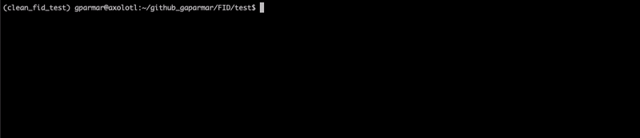
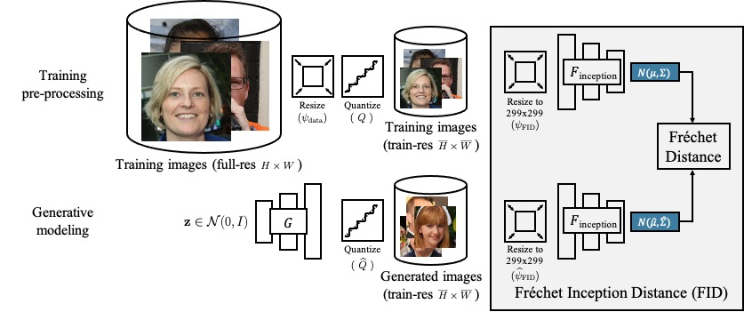
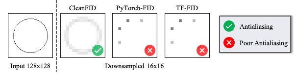
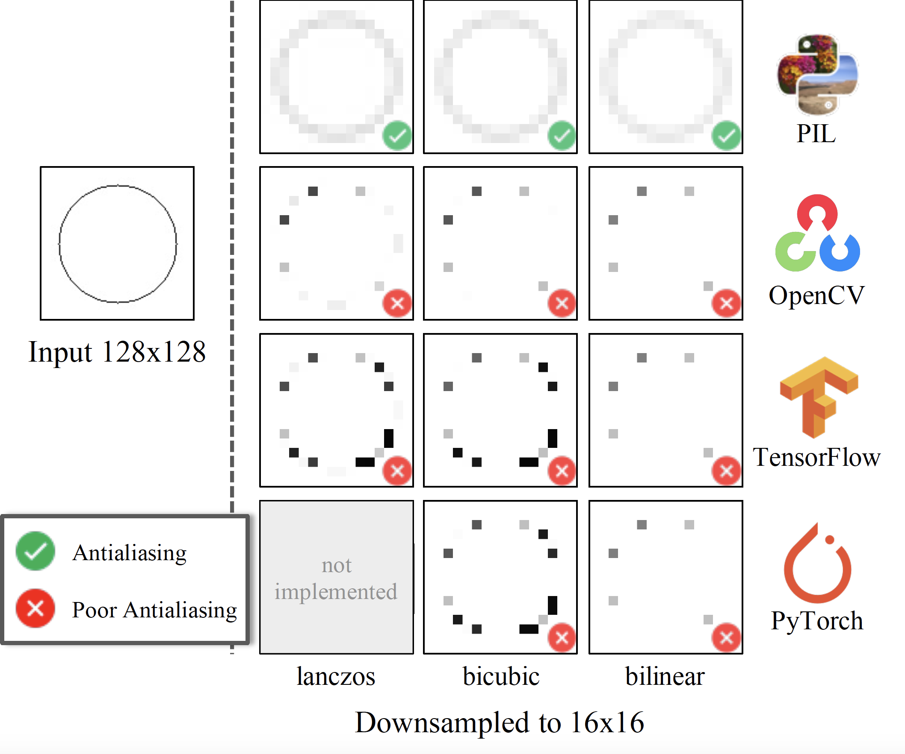
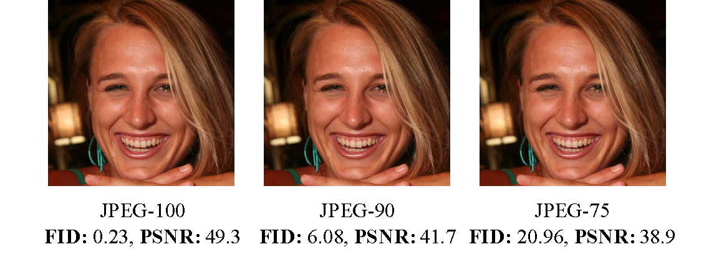
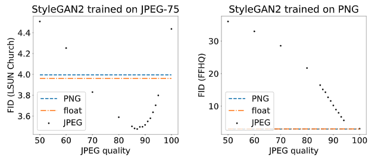

# clean-fid: Fixing Inconsistencies in FID

<br>

  <p align="center">
  
  </p>


[**Project**](https://www.cs.cmu.edu/~clean-fid/) | [**Paper**](https://arxiv.org/abs/2104.11222)


The FID calculation involves many steps that can produce inconsistencies in the final metric. As shown below, different implementations use different low-level image quantization and resizing functions, the latter of which are often implemented incorrectly.

We provide an easy-to-use library to address the above issues and make the FID scores comparable across different methods, papers, and groups.




---

[On Buggy Resizing Libraries and Surprising Subtleties in FID Calculation](https://www.cs.cmu.edu/~clean-fid/) <br>
 [Gaurav Parmar](https://gauravparmar.com/), [Richard Zhang](https://richzhang.github.io/), [Jun-Yan Zhu](https://www.cs.cmu.edu/~junyanz/)<br>
In arXiv 1811.10959 <br>
CMU and Adobe<br>

---


<br>

**Buggy Resizing Operations** <br>

  Resizing operation is often implemented incorrectly by popular libraries.
  <p align="center">
    
  </p>

  The definitions of resizing functions are mathematical and <em>should never be a function of the library being used</em>. Unfortunately, implementations differ across commonly-used libraries.
  
<br>

**JPEG Image Compression**

  Image compression can have a surprisingly large effect on FID.  Images are perceptually indistinguishable from each other but have a large FID score. The FID scores under the images are calculated between all FFHQ images saved using the corresponding JPEG format and the PNG format.

<p align="center">
  
</p>

Below, we study the effect of JPEG compression for StyleGAN2 models trained on the FFHQ dataset (left) and LSUN outdoor Church dataset (right). Note that LSUN dataset images were collected with JPEG compression (quality 75), whereas FFHQ images were collected as PNG. Interestingly, for LSUN dataset, the best FID score (3.48) is obtained when the generated images are compressed with JPEG quality 87.

<p align="center">
  
</p>

---

## Quick Start


- install requirements
    ```
    pip install -r requirements.txt
    ```
- install the library
    ```
    pip install clean-fid
    ```
- FID between two image folders
    ```
    from cleanfid import fid

    score = fid.compare_folders(fdir1, fdir2, num_workers=0,
                batch_size=8, device=torch.device("cuda"),
                use_legacy_pytorch=False,
                use_legacy_tensorflow=False,)
    ```


- FID of a folder of generated images
    ```
    from cleanfid import fid

    score = fid.fid_folder(fdir, dataset_name="FFHQ", dataset_res=1024,
               model=None, use_legacy_pytorch=False,
               use_legacy_tensorflow=False, num_workers=12,
               batch_size=128, device=torch.device("cuda"))
    ```

- FID inline
    ```
    from cleanfid import fid

    # function that accepts a latent and returns an image in range[0,255]
    gen = lambda z: return GAN(latent=z, ... , <other_flags>)

    fid_score = fid.fid_model(gen, dataset_name="FFHQ, dataset_res=1024,
              model=None, z_dim=512, num_fid=50_000,
              use_legacy_pytorch=False, use_legacy_tensorflow=False,
              num_workers=0, batch_size=128,
              device=torch.device("cuda"))
    ```

---
### Make Custom Dataset Statistics
- *dataset_path*: folder where the dataset images are stored
- Generate and save the inception statistics
  ```
  import numpy as np
  from cleanfid import fid
  dataset_path = ...
  mu, sigma = fid.get_folder_features(dataset_path, num=50_000)
  np.savez_compressed("stats.npz", mu=mu, sigma=sigma)
  ```
- See `examples/ffhq_stats.py` for a concrete example
---
## Backwards Compatibility

We provide two flags to reproduce the legacy FID score.

- `use_legacy_pytorch` <br>
    This flag is equivalent to using the popular PyTorch FID implementation provided [here](https://github.com/mseitzer/pytorch-fid/)
    <br>
    The difference between using CleanFID with `use_legacy_pytorch` flag and [code](https://github.com/mseitzer/pytorch-fid/) is **~1.9e-06**
    <br>
    See [doc](docs/pytorch_fid.md) for how the methods are compared


- `use_legacy_tensorflow` <br>
    This flag is equivalent to using the official [implementation of FID](https://github.com/bioinf-jku/TTUR) released by the authors. To use this flag, you need to additionally install tensorflow.

---

## CleanFID Leaderboard for common tasks

<br>

**FFHQ @ 1024x1024**
| Model     | Legacy-FID    | Clean-FID  |
| :---:     | :-:           | :-: |
| StyleGAN2 | 2.85 ± 0.05  | 3.08 ± 0.05 |
| StyleGAN  | 4.44 ± 0.04  | 4.82 ± 0.04 |
| MSG-GAN   | 6.09 ± 0.04  | 6.58 ± 0.06 |

<br>

**Image-to-Image**
(horse->zebra @ 256x256)
Computed using test images

| Model     | Legacy-FID  | Clean-FID  |
| :--:     | :-:           | :-: |
| CycleGAN  | 77.20 | 75.17 |
| CUT       | 45.51 | 43.71 |


---

## Building from source
   ```
   python setup.py bdist_wheel
   pip install dist/*
   ```

---

## Citation

If you find this repository useful for your research, please cite the following work.
```
@article{parmar2021cleanfid,
  title={On Buggy Resizing Libraries and Surprising Subtleties in FID Calculation},
  author={Parmar, Gaurav and Zhang, Richard and Zhu, Jun-Yan},
  journal={arXiv preprint arXiv:2104.11222},
  year={2021}
}
```

---


### Credits
PyTorch-StyleGAN2: [code](https://github.com/rosinality/stylegan2-pytorch)  | [License](ttps://github.com/rosinality/stylegan2-pytorch/blob/master/LICENSE)


PyTorch-FID: [code](https://github.com/mseitzer/pytorch-fid/) | [License](https://github.com/mseitzer/pytorch-fid/blob/master/LICENSE)

StyleGAN2: [code](https://github.com/NVlabs/stylegan2) | [LICENSE](https://nvlabs.github.io/stylegan2/license.html)

converted FFHQ weights: [code](https://github.com/eladrich/pixel2style2pixel) |  [License](https://github.com/eladrich/pixel2style2pixel/blob/master/LICENSE)
